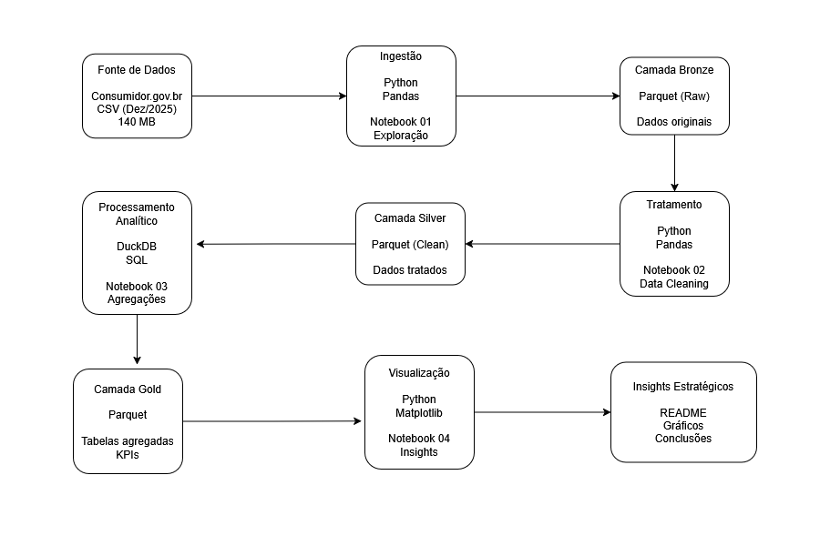

<h1>Análise de Qualidade e Eficiência no Atendimento ao Consumidor</h1>

<h3>Estudo Analítico do Segmento de Comércio Eletrônico utilizando SQL e Python</h3>

<h2>Visão Executiva</h2>

Este projeto implementa um pipeline analítico completo para avaliar a qualidade e eficiência do atendimento ao consumidor no segmento de <b>Comércio Eletrônico</b>, utilizando dados públicos da plataforma consumidor.gov.br.

A solução foi estruturada utilizando <b>DuckDB (SQL analítico)</b> e <b>Python (Pandas, NumPy e Data Visualization)</b>, com arquitetura em camadas que garante reprodutibilidade, clareza metodológica e separação entre transformação e análise.

O objetivo é simular um cenário real de análise operacional, identificando padrões, gargalos e oportunidades de melhoria com base em indicadores mensuráveis.

<h2>Problema de Negócio</h2>

O atendimento ao consumidor é um componente crítico da operação de empresas de comércio eletrônico, impactando diretamente:

<ul>
<li>Satisfação e retenção de clientes</li>
<li>Eficiência operacional</li>
<li>Custos de atendimento</li>
<li>Reputação e competitividade</li>
</ul>

Este projeto busca avaliar o desempenho do segmento de Comércio Eletrônico em relação ao mercado, identificando oportunidades de melhoria com base em dados reais.

<h2>Arquitetura da Solução</h2>

O pipeline foi estruturado em camadas independentes:

<ul>
<li><b>Camada Raw:</b> ingestão de dados CSV originais</li>
<li><b>Camada Processed:</b> limpeza e persistência em formato Parquet</li>
<li><b>Camada Analítica:</b> agregações e cálculo de métricas em SQL (DuckDB)</li>
<li><b>Camada de Insights:</b> visualização e interpretação em Python</li>
</ul>

Essa abordagem reflete práticas utilizadas em ambientes analíticos reais, com separação clara entre transformação, agregação e interpretação.

<h2>Decisões Técnicas</h2>

<ul>

<li>
<b>Uso de DuckDB como motor analítico:</b> escolhido por sua capacidade de executar queries SQL analíticas diretamente sobre arquivos Parquet, eliminando a necessidade de banco relacional dedicado e permitindo alta performance em ambiente local.
</li>

<li>
<b>Persistência em formato Parquet:</b> adotado por sua compressão eficiente e leitura columnar, reduzindo uso de memória e melhorando desempenho em operações analíticas.
</li>

<li>
<b>Separação do pipeline em múltiplos notebooks:</b> estruturado em etapas independentes (exploração, tratamento, agregação e análise) para melhorar organização, reprodutibilidade e manutenibilidade.
</li>

<li>
<b>Uso combinado de SQL e Python:</b> SQL utilizado para agregações e métricas analíticas, enquanto Python foi utilizado para exploração, manipulação e visualização, seguindo práticas comuns em ambientes de análise de dados.
</li>

<li>
<b>Anonimização de entidades sensíveis:</b> nomes de empresas foram removidos deliberadamente para evitar exposição indevida e manter o foco na análise metodológica e nos padrões estruturais dos dados.
</li>

</ul>

<h2>Pipeline de Dados</h2>

<ul>
<li><b>Exploração:</b> análise inicial do schema, tipos e consistência</li>
<li><b>Tratamento:</b> limpeza de dados e persistência em formato colunar (Parquet)</li>
<li><b>Agregação:</b> cálculo de métricas operacionais utilizando SQL</li>
<li><b>Análise:</b> interpretação e visualização dos indicadores</li>
</ul>

<h2>Metodologia</h2>

Para garantir consistência e evitar duplicidade de registros, foi utilizada a base consolidada referente a <b>dezembro de 2025</b>, que representa um snapshot completo e sem sobreposição de reclamações.

A coluna de identificação das empresas foi removida deliberadamente para:

<ul>
<li>Garantir neutralidade analítica</li>
<li>Evitar exposição indevida de entidades específicas</li>
<li>Focar na análise sistêmica do segmento</li>
</ul>

<h2>Exemplo de Query SQL</h2>

Exemplo de cálculo do índice de solução por segmento, utilizado para avaliação comparativa de desempenho entre setores do mercado.

<pre><code class="language-sql">
SELECT
    "Segmento de Mercado",
    SUM(CASE WHEN "Situação" = 'Finalizada avaliada' AND "Avaliação Reclamação" = 'Resolvida' THEN 1 ELSE 0 END) AS "Reclamações Resolvidas",
    SUM(CASE WHEN "Situação" = 'Finalizada não avaliada' THEN 1 ELSE 0 END) AS "Reclamações Não Avaliadas",
    SUM(CASE WHEN "Situação" IN ('Finalizada avaliada', 'Finalizada não avaliada') THEN 1 ELSE 0 END) AS "Total Finalizadas",
    CAST(
        SUM(CASE WHEN "Situação" = 'Finalizada avaliada' AND "Avaliação Reclamação" = 'Resolvida' THEN 1 ELSE 0 END) +
        SUM(CASE WHEN "Situação" = 'Finalizada não avaliada' THEN 1 ELSE 0 END)
    AS DOUBLE) *
    100.0 /
    NULLIF(SUM(CASE WHEN "Situação" IN ('Finalizada avaliada', 'Finalizada não avaliada') THEN 1 ELSE 0 END), 0)
    AS "Índice de Solução"
FROM
    base_completa_2025_12
GROUP BY
    "Segmento de Mercado"
ORDER BY
    "Índice de Solução" DESC
</code></pre>

Esta query foi executada em DuckDB sobre arquivos Parquet, para calcular indicadores de desempenho e ranking competitivo entre segmentos de mercado.

<h2>Indicadores Desenvolvidos</h2>

<ul>
<li>Nota média do consumidor</li>
<li>Índice de resolução de reclamações</li>
<li>Tempo médio de resposta</li>
<li>Impacto do SAC na resolução</li>
<li>Proporção de reclamações improcedentes</li>
</ul>

<h2>Principais Conclusões Estratégicas</h2>

<h3>1. Satisfação do consumidor ligeiramente superior à média do mercado</h3>

O segmento de Comércio Eletrônico apresenta nota média de satisfação de <b>2,52</b>, acima da média geral de <b>2,41</b>, indicando percepção positiva do consumidor em relação à qualidade do serviço.

Esse resultado sugere que, apesar de possíveis ineficiências operacionais, a percepção final do consumidor permanece relativamente favorável.

 

<h3>2. Tempo de resposta significativamente superior representa principal gargalo operacional</h3>

O tempo médio de resposta no segmento é de aproximadamente <b>9,91 dias</b>, significativamente superior à média do mercado de <b>7,17 dias</b>.

Esse resultado indica potencial ineficiência operacional e representa o principal ponto de melhoria identificado.

 

<h3>3. Capacidade de resolução alinhada ao mercado, sem vantagem competitiva clara</h3>

O índice de resolução do segmento é de aproximadamente <b>81,13%</b>, praticamente equivalente à média geral.

Isso indica operação estável, porém sem diferenciação competitiva relevante.

 

<h3>4. Atendimento inicial não apresenta impacto significativo na resolução</h3>

A taxa de resolução é semelhante entre consumidores que buscaram o SAC previamente e aqueles que não buscaram.

Esse resultado sugere oportunidade de melhoria na eficiência do atendimento inicial.

 

<h3>5. Maior proporção de reclamações improcedentes sugere desalinhamento de expectativas</h3>

O segmento apresenta proporção maior de reclamações classificadas como improcedentes em comparação à média geral.

Isso pode indicar necessidade de melhoria na comunicação com o consumidor ou maior clareza nas políticas operacionais.

<h2>Recomendações Baseadas em Dados</h2>

<ul>
<li>Investigar causas do maior tempo de resposta</li>
<li>Otimizar processos operacionais de atendimento</li>
<li>Melhorar eficiência do atendimento inicial</li>
<li>Utilizar a boa percepção de qualidade como base para diferenciação competitiva</li>
</ul>

<h2>Stack Tecnológica</h2>

<ul>
<li>Python</li>
<li>Pandas</li>
<li>NumPy</li>
<li>DuckDB</li>
<li>SQL</li>
<li>Parquet</li>
<li>Matplotlib / Seaborn</li>
<li>Google Colab</li>
</ul>

<h2>Como Reproduzir</h2>

Para reproduzir a análise, siga os passos abaixo:

<ol>
<li>Clone este repositório:</li>
</ol>

<pre>
git clone https://github.com/fernandoferret/portfolio_consumidor_gov.git
</pre>

<ol start="2">
<li>Certique-se que os dados brutos (csv) estejam descompactados na pasta correta do Google Drive a partir do zip: basecompleta2025-12.zip</li>
</ol>

<ol start="3">
<li>Abra o ambiente no Google Colab e execute os notebooks na seguinte ordem:</li>
</ol>

<pre>
notebooks/01_consumidor_exploracao.ipynb
notebooks/02_consumidor_tratamento.ipynb
notebooks/03_consumidor_analise.ipynb
notebooks/04_consumidor_insights.ipynb
</pre>

Os dados intermediários são persistidos em formato Parquet e utilizados nas etapas seguintes.

<h2>Estrutura do Projeto</h2>

<pre>
notebooks/
├── 01_consumidor_exploracao.ipynb
├── 02_consumidor_tratamento.ipynb
├── 03_consumidor_analise.ipynb
└── 04_consumidor_insight.ipynb

data/
├── raw/
└── processed/

images/

README.md
</pre>

<h2>Limitações</h2>

<ul>
<li>Análise baseada em snapshot único (dezembro de 2025)</li>
<li>Não representa análise longitudinal</li>
<li>Dados anonimizados deliberadamente</li>
</ul>

<h2>Objetivo do Projeto</h2>

Este projeto foi desenvolvido como parte de um portfólio profissional, com o objetivo de demonstrar:

<ul>
<li>Capacidade de estruturar pipelines analíticos completos</li>
<li>Uso combinado de SQL e Python em contexto analítico</li>
<li>Capacidade de transformar dados em insights acionáveis</li>
<li>Aplicação de boas práticas de arquitetura analítica</li>
</ul>

<h2>Fontes</h2>

Ministério da Justiça: https://dados.mj.gov.br/dataset/reclamacoes-do-consumidor-gov-br

